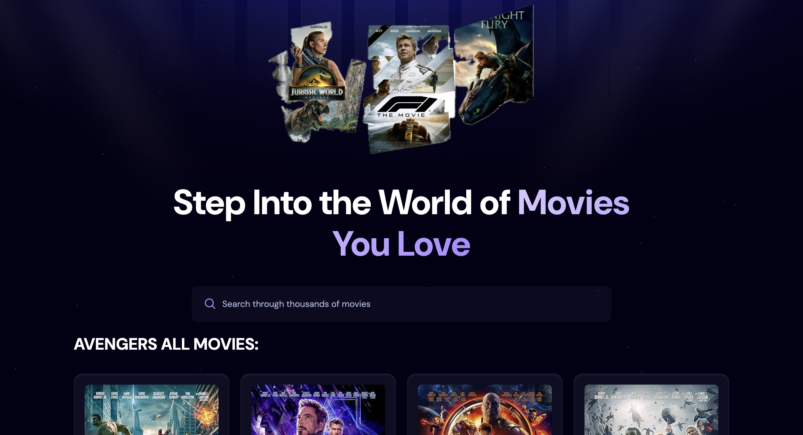
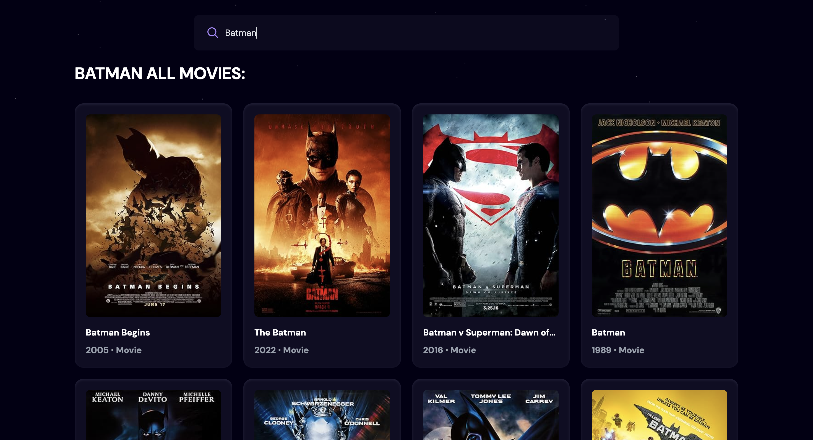
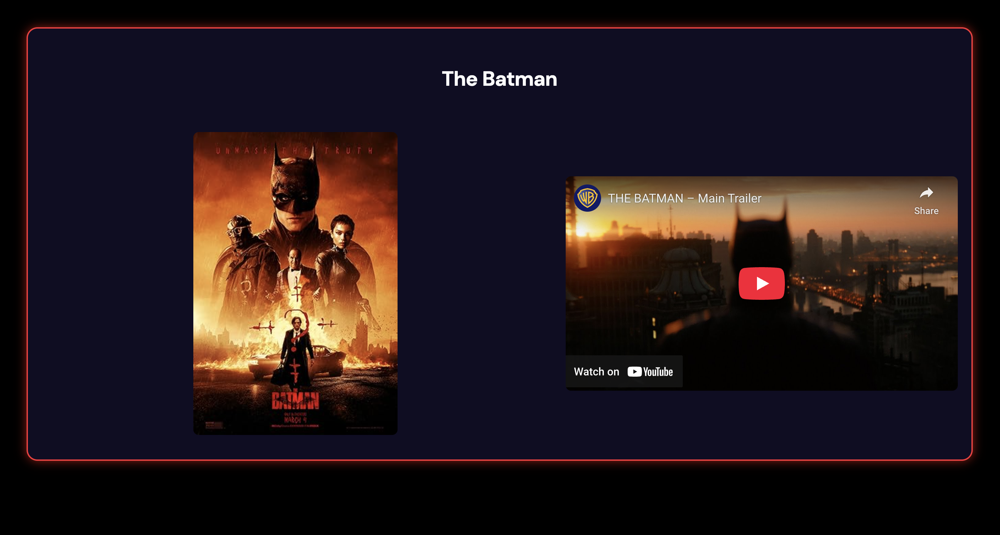

## Hey, This is Sabit Bin Azad
---
## 🎬 Film Hunt

A sleek and responsive movie search web application built with **React**, **Vite**, and **Tailwind CSS**, powered by the **OMDB API** and **YouTube Data API**. This app allows users to search for movies, and see detailed information about each film with youtube trailer.

🌐 [Live Demo](https://sba-movie.vercel.app/)

---

## ✨ Features

- 🔍 Search for movies using the OMDB API
- 🎥 Watch related trailers via YouTube
- 🌙 Modern, dark-themed UI with Tailwind CSS
- ⚡ Blazing-fast performance with Vite
- 📱 Responsive design for all devices

---

## 🛠️ Tech Stack

- **Frontend:** React, Tailwind CSS
- **Routing:** React Router DOM
- **API:** OMDB API and YouTube Data API
- **Debounce:** `react-use` for search optimization
- **Deployment:** Vercel

---

## 📸 Screenshots

| 🏠 Home View | 🔍 Search View | 🎬 Movie Details |
|-------------|----------------|------------------|
|  |  |  | 


---


## <a name="quick-start">Quick Start</a>

Follow these steps to set up the project locally on your machine.

**Prerequisites**

Make sure you have the following installed on your machine:

- [Git](https://git-scm.com/)
- [Node.js](https://nodejs.org/en)
- [npm](https://www.npmjs.com/) (Node Package Manager)

**Cloning the Repository**

```bash
git clone https://github.com/sabitbinazad/movie
cd movie

```

**Installation**

Install the project dependencies using npm:

```bash
npm install
```

**Set Up Environment Variables**

Create a new file named `.env.local` in the root of your project and add the following content:

```env
VITE_OMDB_API_KEY=

VITE_YOUTUBE_API_KEY=

```

Replace the placeholder values with your actual **[OMDB API KEY]** and **[YOUTUBE API KEY]** credentials.

**Running the Project**

```bash
npm run dev
```

Open [http://localhost:5173](http://localhost:5173) in your browser to view the project.

---

## Contributing

Contributions are welcome! If you have suggestions for improving this project, feel free to open an issue or submit a pull request.

---

## License

This project is licensed under the MIT License. See the [LICENSE](LICENSE) file for details.


---

## Contact

For any questions or suggestions, feel free to reach out:
- **Name**: Sabit Bin Azad
- **Email**: sabitbinaza01@gmail.com
- **GitHub**: https://github.com/sabitbinazad
- **LinkedIn**: https://www.linkedin.com/in/sabitbinazad
